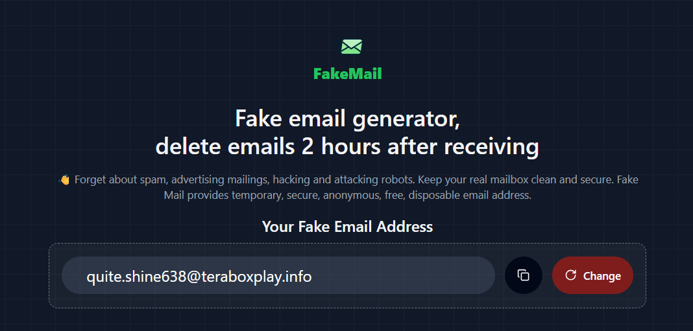

# Fake Mail - The free temporary email service

📪 Website: [https://teraboxplay.info](https://teraboxplay.info)

## Fake email generator, delete emails 24 hours after receiving

This is a temporary email service that uses Cloudflare Workers to create a temporary email address and view the received email in web browser.

` /app ` - Astro ssr

` /mailbox ` - Cloudflare Worker

## Multiple email addresses

use [clerk](https://clerk.com/) to login && register

Data is stored encrypted on cloudflare D1

## License

Fake Mail is licensed under the [MIT License](https://github.com/akshaythummar/fakemail/blob/main/LICENSE).

----------------- deploy fresh app on new cloudflare account --------------

npx wrangler kv namespace create POST_DB

npm wrangler d1 create MAIL_DB

# backend deployment 
# change KV and D1 values in wrangler.toml
cd mailbox

npx wrangler deploy

# frontend deployment
# change KV and D1 values in wrangler.toml 
build -> cmd /c "d: && cd d:\THUMMAR\fakemail\app && npm run build"

deploy-> cmd /c "d: && cd d:\THUMMAR\fakemail\app && npx wrangler pages deployment create --commit-dirty=true"

# changes in the cloudflare 
# add domain nameserver in the bigrock
# add turnstile key with domain name (it will work on the production only as it created by the domain name) 
# enable email routing 
