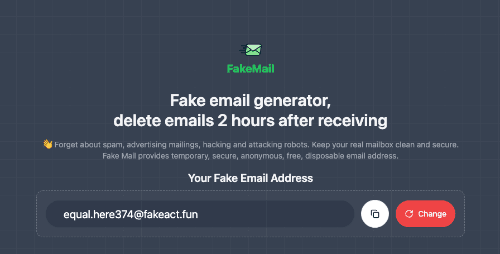

# Fake Mail - The free temporary email service

📪 Website: [https://mail.fakeact.fun](https://mail.fakeact.fun)

## Fake email generator, delete emails 2 hours after receiving

This is a temporary email service that uses Cloudflare Workers to create a temporary email address and view the received email in web browser.

` /app ` - Astro ssr

` /mailbox ` - Cloudflare Worker

## Multiple email addresses

use [clerk](https://clerk.com/) to login && register

Data is stored encrypted on cloudflare D1

## License

Fake Mail is licensed under the [MIT License](https://github.com/CH563/fakemail/blob/main/LICENSE).

build commands :
build -> cmd /c "d: && cd d:\THUMMAR\fakemail\app && npm run build"
deploy-> cmd /c "d: && cd d:\THUMMAR\fakemail\app && npx wrangler pages deployment create --commit-dirty=true"